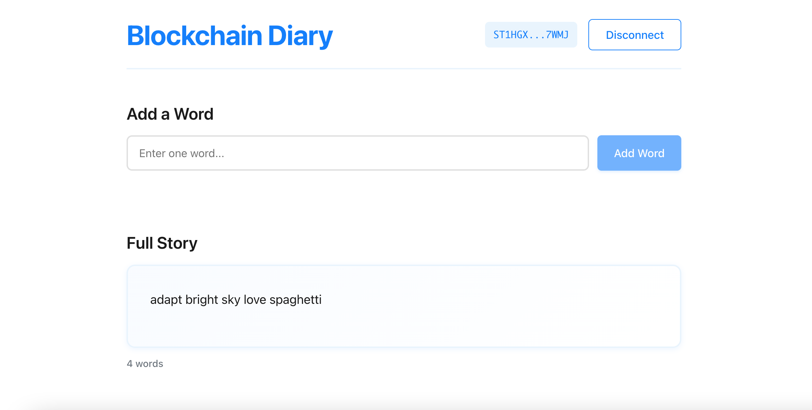

# Blockchain Diary

A collaborative storytelling dApp built on the Stacks blockchain where users contribute one word at a time to create a shared story. Built with Clarity 4 smart contracts and a modern React frontend.



## Features

- **One Word at a Time**: Users can add a single word (max 32 characters) to the collaborative story
- **Real-time Updates**: Story automatically refreshes every 10 seconds to show new contributions
- **Contributor Tracking**: See all contributors and their word counts
- **Wallet Integration**: Connect any SIP-030 compatible wallet (Hiro, Xverse, etc.)
- **Modern UI**: Clean, minimal white and blue design

## Tech Stack

### Smart Contract
- **Clarity 4**: Latest version of the Clarity language
- **Clarinet**: Development and testing framework
- **Deployed on Stacks Testnet**

### Frontend
- **React 19**: Modern React with hooks
- **TypeScript**: Type-safe development
- **Vite**: Fast build tool and dev server
- **@stacks/connect**: SIP-030 wallet integration
- **@stacks/transactions**: Contract interaction utilities

## Clarity 4 Features

This contract leverages several Clarity 4 features:

1. **Bounded Lists**: The story is stored as a `(list 200 {...})` with a maximum capacity of 200 entries
2. **`as-max-len?` Function**: Used to safely append to the bounded list while maintaining type safety
3. **Clarity 4 Epoch**: Contract is configured for the latest Clarity 4 epoch
4. **Enhanced Type System**: Improved type checking and safety features in Clarity 4

## Project Structure

```
blockchain-diary/
├── contracts/
│   └── story.clar          # Clarity 4 smart contract
├── frontend/
│   ├── src/
│   │   ├── components/     # React components
│   │   ├── contexts/       # React contexts (Wallet)
│   │   ├── hooks/          # Custom hooks (useStory)
│   │   └── ...
│   └── package.json
├── tests/
│   └── story.test.ts       # Contract tests
├── settings/               # Network configurations
└── Clarinet.toml           # Clarinet configuration
```

## Getting Started

### Prerequisites

- [Node.js](https://nodejs.org/) (v18 or higher)
- [Clarinet](https://docs.hiro.so/clarinet) (for contract development)
- A Stacks wallet (Hiro or Xverse) for testing

### Installation

1. Clone the repository:
```bash
git clone <repository-url>
cd blockchain-diary
```

2. Install contract dependencies:
```bash
# Install Clarinet (if not already installed)
# See: https://docs.hiro.so/clarinet/installing-clarinet
```

3. Install frontend dependencies:
```bash
cd frontend
npm install
```

### Development

#### Contract Development

Check the contract:
```bash
clarinet check
```

Run tests:
```bash
npm run test
```

#### Frontend Development

Start the development server:
```bash
cd frontend
npm run dev
```

The app will be available at `http://localhost:5173`

### Building for Production

Build the frontend:
```bash
cd frontend
npm run build
```

The built files will be in `frontend/dist/`

## Contract Details

### Contract Address (Testnet)
```
ST1HGXPGWSHPHW3PNC66FWQ5VG1PFNYKBCSCQ7WMJ.story
```

### Public Functions

#### `add-word`
Adds a single word to the story.

**Parameters:**
- `word`: `(string-ascii 32)` - The word to add (max 32 characters)

**Returns:**
- `(ok { added: word, by: sender, at: timestamp })` on success
- `(err u100)` if the story is full (200 words)

#### `get-story`
Read-only function that returns the entire story.

**Returns:**
- `(ok (list 200 {...}))` - List of story entries

#### `story-length`
Read-only function that returns the number of words in the story.

**Returns:**
- `(ok uint)` - The length of the story

### Story Entry Structure

Each entry in the story contains:
- `word`: The contributed word (string-ascii, max 32 chars)
- `sender`: The principal address of the contributor
- `timestamp`: Timestamp of when the word was added (uint)

## Frontend Features

### Components

- **WalletConnection**: Handles wallet connection/disconnection
- **AddWord**: Form to submit new words to the story
- **FullStory**: Displays the complete story as a continuous text
- **Contributors**: Shows all contributors and their contribution counts

### Hooks

- **useStory**: Fetches and manages story data with automatic polling
- **useWallet**: Manages wallet connection state

### Real-time Updates

The app automatically polls the contract every 10 seconds to fetch new words. After adding a word, the story refreshes immediately and polling continues to catch updates from other users.

## Deployment

### Contract Deployment

The contract is deployed to Stacks Testnet. To deploy:

```bash
clarinet deployment generate --testnet
clarinet deployment apply --testnet
```


Update the contract address in `frontend/src/constants.ts` if deploying to a different network.

## Contributing

Contributions are welcome! Please feel free to submit a Pull Request.

## License

ISC

## Resources

- [Stacks Documentation](https://docs.stacks.co/)
- [Clarity Language Reference](https://docs.stacks.co/docs/clarity)
- [Clarity 4 Features](https://docs.stacks.co/docs/clarity/clarity-4)
- [Clarinet Documentation](https://docs.hiro.so/clarinet)
- [@stacks/connect Documentation](https://github.com/stacks-network/connect)

## Acknowledgments

Built with the Stacks blockchain and Clarity 4 smart contract language.

